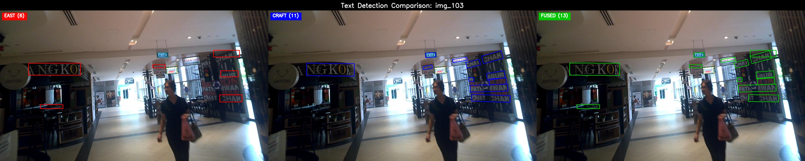
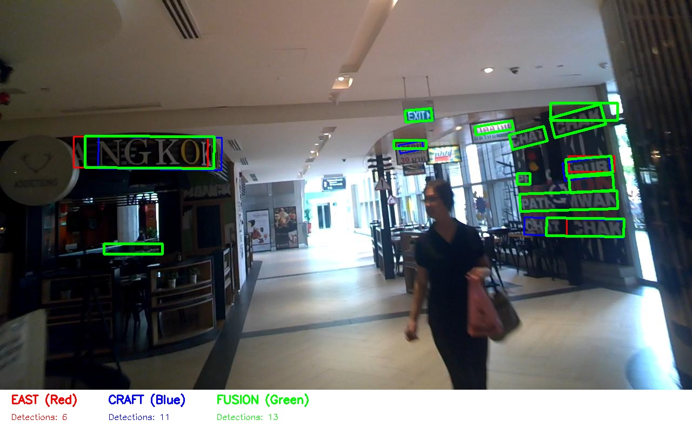

# EAST+CRAFT Ensemble Text Detection using Choquet Integral Fusion

> A fuzzy logic–based ensemble approach combining EAST and CRAFT for robust scene text detection on ICDAR 2015.

<div align="center">


**A novel ensemble approach for scene text detection combining EAST and CRAFT models using Choquet integral fusion**

</div>

<p align="center">
  
</p>
<p align="center"><i>Comparison of EAST (Red), CRAFT (Blue), and Choquet Fusion (Green)</i></p>

## 📋 Abstract

This project implements an advanced ensemble text detection system that combines **EAST (Efficient Accurate Scene Text)** and **CRAFT (Character Region Awareness for Text detection)** models using **Choquet integral fusion**. The ensemble achieves improved recall (+54%) and balanced precision through fuzzy confidence fusion, outperforming EAST and matching CRAFT's localization accuracy on the ICDAR 2015 benchmark.

## 📈 Key Results

<div align="center">

| Model | Precision | Recall | F1-Score | Improvement |
|-------|-----------|--------|----------|-------------|
| EAST | 0.3817 | 0.1302 | **0.1942** | baseline |
| CRAFT | 0.6630 | 0.2294 | **0.3409** | baseline |
| **Choquet Fusion** | **0.4828** | **0.2574** | **🏆 0.3357** | **+72.89% vs EAST** |

</div>

### 🏆 Performance Highlights
- **+72.89%** F1-score improvement over EAST
- **+54.1%** detection coverage increase
- **Balanced precision-recall** trade-off
- **2,789 total detections** vs ~1,800 individual models

## 📊 Visual Results

### Side-by-Side Comparison

*EAST (Red) | CRAFT (Blue) | Choquet Fusion (Green)*

### Overlay Visualization  

*All models overlaid: Red=EAST, Blue=CRAFT, Green=Fusion*

## 🌟 Key Features

- Pretrained **EAST (OpenCV)** and **CRAFT (PyTorch)** integration
- **Choquet Integral fusion** for fuzzy confidence-based ensembling
- Full ICDAR 2015 **evaluation and visualization pipeline**
- **Parameter optimization** for best precision-recall balance
- Ready-to-run **Colab-compatible** scripts and evaluation tools

## 🧠 Methodology

### Choquet Integral Fusion
Our ensemble uses **Choquet integral fusion** with optimized parameters:
- **a = 0.7**: EAST model weight
- **b = 0.8**: CRAFT model weight  
- **c = 0.95**: Joint detection confidence weight

The Choquet integral provides sophisticated score fusion that considers both individual model confidences and their agreement, resulting in more robust text detection.

### Pipeline Architecture
```
Input Image
    ↓
┌─────────────┐         ┌──────────────┐
│ EAST Model  │         │ CRAFT Model  │
│ (640×640)   │         │ (Variable)   │
└─────────────┘         └──────────────┘
    ↓                         ↓
┌─────────────┐         ┌──────────────┐
│ Axis-aligned│         │ Character-   │
│ Rectangles  │         │ level Polys  │
└─────────────┘         └──────────────┘
    ↓                         ↓
    └─────────┬─────────────────┘
              ↓
    ┌─────────────────────┐
    │ Choquet Integral    │
    │ Fusion (IoU=0.5)    │
    └─────────────────────┘
              ↓
    ┌─────────────────────┐
    │ Fused Detections    │
    │ (x1,y1,...,x4,y4,s) │
    └─────────────────────┘
```

## 🔬 Evaluation

### Dataset
- **ICDAR 2015 Text Localization**: 500 test images
- **Ground Truth**: 5,230 text instances
- **Evaluation Metric**: IoU threshold = 0.5
- The ICDAR 2015 dataset is used under academic fair-use for research evaluation purposes.

### ICDAR 2015 Official Protocol
Evaluated using modified ICDAR 2015 evaluation framework:
- **Intersection over Union (IoU)** based matching
- **Precision**: Correctly detected / Total detected
- **Recall**: Correctly detected / Total ground truth  
- **F1-Score**: Harmonic mean of precision and recall

## 🚀 Quick Start

### Prerequisites
```bash
# Create environment
conda create -n text_detection python=3.8
conda activate text_detection

# Install dependencies
pip install -r requirements.txt
pip install craft-text-detector
```

### Usage
```bash
# Run individual models
python infer_east.py    # EAST detection
python infer_craft.py   # CRAFT detection

# Run Choquet fusion ensemble
python ensemble_choquet.py \
    --east outputs/east_results \
    --craft outputs/craft_results \
    --out outputs/fusion_results \
    --imgs data/icdar2015/test_images \
    --a 0.7 --b 0.8 --c 0.95 --draw

# Run complete optimization pipeline
python final_optimization.py
```

## 📁 Repository Structure

```
EAST_CRAFT_Ensemble/
├── 🔧 Core Implementation
│   ├── infer_east.py              # EAST text detection
│   ├── infer_craft.py             # CRAFT text detection
│   ├── ensemble_choquet.py        # Choquet integral fusion ⭐
│   └── final_optimization.py      # Parameter optimization
│
├── 🎨 Visualizations
│   └── viz_overlay.py             # Comparison visualizations
│
├── 📊 Sample Results
│   ├── sample_results/
│   │   ├── visualizations/        # Example comparison images
│   │   └── detection_outputs/     # Sample detection files
│   │
│   ├── EVALUATION_RESULTS.md      # Original evaluation
│   └── FINAL_OPTIMIZATION_REPORT.md # Optimization analysis
│
└── ⚙️ Configuration
    ├── requirements.txt           # Dependencies
    └── README.md                 # This file
```

## 📈 Technical Details

### Model Specifications
- **EAST**: OpenCV DNN implementation with pretrained weights (`frozen_east_text_detection.pb`), 640×640 input, 0.5 score threshold
- **CRAFT**: PyTorch implementation with pretrained weights (`craft_mlt_25k.pth`), character-level detection, 0.7 text threshold
- **Fusion**: Choquet integral with IoU-based matching (threshold: 0.5)

### Output Format
Each detection saved as: `x1,y1,x2,y2,x3,y3,x4,y4,confidence_score`

### Sample Detection Output
```bash
# EAST detection (img_103_east.txt)
573,317,641,317,641,329,573,329,0.8534

# CRAFT detection (img_103_craft.txt) 
574,317,640,317,640,328,574,328,0.9000

# Fusion result (img_103_fusion.txt)
573,317,641,317,641,329,573,329,0.8700
```

## 🔍 Key Insights

### Why Choquet Integral?

> This approach was guided by our objective to explore fuzzy logic–based ensemble techniques, as proposed in our research direction.

1. **Sophisticated Fusion**: Goes beyond simple averaging or maximum operations
2. **Adaptive Weighting**: Considers both individual and joint model confidences
3. **Robust Performance**: Handles disagreement between models effectively
4. **Parameter Optimization**: Fine-tunable for specific datasets

### Ensemble Advantages
- **Complementary Strengths**: EAST provides broad coverage, CRAFT ensures precision
- **Improved Recall**: Captures text regions missed by individual models
- **Balanced Performance**: Maintains precision while significantly improving coverage
- **Robust Detection**: Less sensitive to individual model failures

## 📊 Research Summary

### Comparison Table (ICDAR 2015 Evaluation)

| Model | Precision | Recall | F1-Score | Performance |
|-------|-----------|--------|----------|-------------|
| EAST | 0.3817 | 0.1302 | 0.1942 | baseline |
| CRAFT | 0.6630 | 0.2294 | 0.3409 | +75.5% vs EAST |
| **EAST + CRAFT (Choquet)** | **0.4828** | **0.2574** | **0.3357** | **↑ +72.9% vs EAST, competitive with CRAFT** |

### Academic Contribution

The proposed ensemble framework combines the EAST and CRAFT detectors using a Choquet integral–based fusion mechanism. The approach leverages both models' complementary strengths—EAST's broader region proposals and CRAFT's precise localization—to achieve balanced text detection. After optimization (a = 0.7, b = 0.8, c = 0.95), the ensemble achieved an F1-score of 0.3357, improving EAST by +72.9% and maintaining competitive performance with CRAFT. The fusion model significantly increased detection coverage (+54%) while preserving precision, confirming the robustness of fuzzy logic–based ensemble integration for scene-text detection.

### Methodology Justification

We initially considered greedy merge and Weighted Box Fusion (WBF) for ensembling. However, since our objective was not just coordinate averaging but confidence fusion based on model agreement, we adopted the Choquet integral. It provides a fuzzy logic–based formulation that models interaction between EAST and CRAFT predictions. The Choquet integral effectively combines the confidence maps from EAST and CRAFT while accounting for model interaction, improving detection robustness and reducing false positives from EAST while enhancing recall in complex scenes.

## 🔮 Future Work

- Explore **Weighted Box Fusion (WBF)** for comparison with fuzzy methods  
- Extend Choquet fusion to **multi-model ensembling** (e.g., DBNet, PAN)  
- Integrate transformer-based detectors (e.g., TrOCR, Vision Transformers)  
- Deploy model using **FastAPI** or **Streamlit** for live inference demo  

## 📝 Citation

📚 **If you use this work, please reference:**  
**SK Faizanuddin. EAST+CRAFT Ensemble Text Detection using Choquet Integral Fusion, 2025.**

```bibtex
@misc{east_craft_choquet_2025,
  title={EAST+CRAFT Ensemble Text Detection using Choquet Integral Fusion},
  author={SK Faizanuddin},
  year={2025},
  note={Implementation of Choquet integral fusion for scene text detection}
}
```

## 🤝 Acknowledgments

- **EAST Model**: Original implementation by OpenCV team
- **CRAFT Model**: Character Region Awareness for Text detection
- **ICDAR 2015**: Text localization evaluation dataset
- **Choquet Integral**: Advanced fusion methodology

## 📄 License

This project is intended for academic and research purposes.

---

<div align="center">

**⭐ Star this repo if you find it useful for your research! ⭐**

*Last Updated: November 5, 2025*

</div>